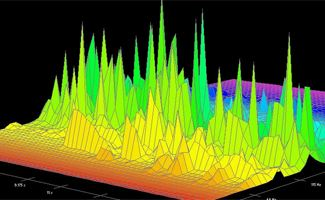
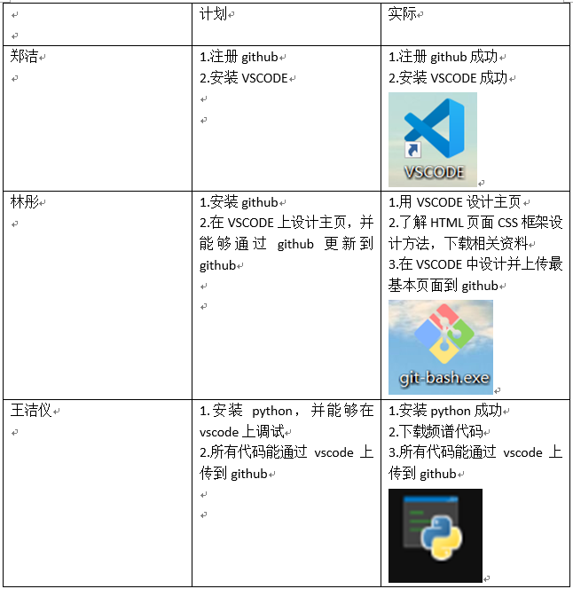

<IDOCTYPE html>
<html>
<head>
<meta charset="utf-8">
</head>
<body>
<title>欢迎来到我们的主页</title>
<h1>
欢迎来到我们的主页
</h1>
<h2 style="color:blue;">信号与系统大作业</h2>
<h4>组长：林彤   学号：3180432005</h4> 
<h4>组员：郑洁   学号：3180432006</h4>
<h4>组员：王洁仪 学号：3180432004</h4>

 

 经过一段时间的学习，信号与系统大作业终于完成。
<h3 style="color:blue;">各类典型信号对应的频谱</h3>

<p1><b>1.任务安排</b></p1>

<p1><b>2.实验步骤</b></p1>

(1) pycharm新建项目，导入matplotlib,numpy，新建Python文件 
(2) 输入绘制图形和频谱代码，运行当前文件 
(3) 绘图窗口出现信号图及其频谱图 
(4) 调整参数并记录

<p1><b>3.程序</b></p1>

<p1><b>4.大作业</b></p1>

<p1><a href="https://github.com/13123891831/hello/blob/master/ppt.pptx"><b>5.PPT</b></a></p1>

</body>
</html>
